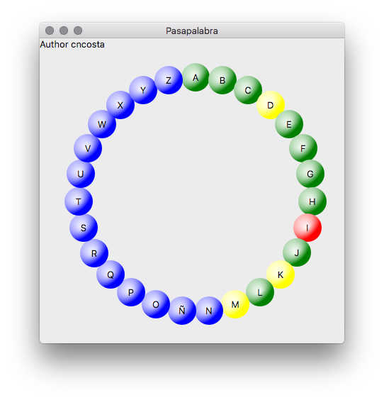

# Rosco :ab: :red: :blue:
 Rosco de pasapalabra para jugar online
## Como usarlo
### Ejecutarlo en Python
1. Descargar [python](https://www.python.org/downloads/) versiones 3.7 o 3.6
2. Descragar [PyQt5](https://pypi.org/project/PyQt5/) libreria especial para la interfaz gráfica
3. Descargar los archivos  ``front_end.py``  y ``parametros.py`` deben estar en la misma carpeta. 
4. Ejecutar ``front_end.py``

#### Para descargar la aplicacion para MacOS ir al siguente [link](https://drive.google.com/drive/folders/1mP8Fu-MCwGMru6dQP96C5xUhqY7aBtcn?usp=sharing)

#### Version Windows no implementada aún. 

## Funcionamiento
Cada vez que se hace click en una letra, esta cambiara de color, pasando de 
``azul -> verde -> rojo -> amarillo -> azul``. 

